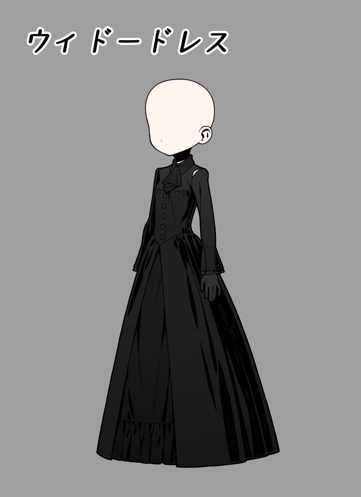
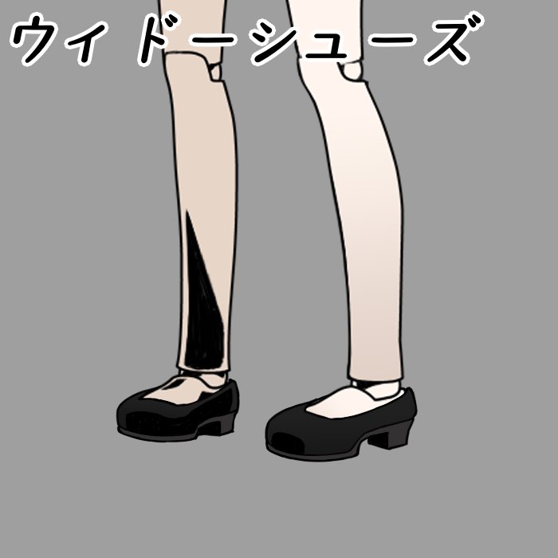

# 2024/09/06 被推迟的定期维护公告

## 角色

- 实装路德R5

## 游戏更新

- 排行榜月结

- 9月排行榜奖励

  - BP前5/30/100名：王者的斗篷1/2/3（有效期至下次月结维护）+冥印10/5/3个
  - 亚城2胜：「ウィドーハット」（未亡人的帽子）+库勒尼西专武｢アポカリプス｣（启示录）
    - 奖励中的服饰（帽子）今后可能会在商店单独销售
  - QP：前5/30/100名：冥印10/5/3个
  - QP满1000：库勒尼西专武｢アポカリプス｣（启示录）

- 亚历山大城Cost分区更换为：52/65/77/90+

- 实装赠送地图任务

  - 根据送出的任务稀有度，在对方完成后能够获得gem

    - ★1~10对应10/20/30/50/80/120/180/250/350/500gem
    - Ex影、Ex月大陆★6及以上任务的回馈gem翻倍

  - 如果最后一格有奖励，则赠送方也能在任务被完成后获得同样的奖励

    - exp、奖励游戏(High&Low/爬星)则为完成任务时的排头角色等级x50gem

    - 如果是使用ムネメの栞(书签)获得的任务，则为1000gem

  - 一个任务只能被赠送一次

  - 完成被赠送的任务不会获得QP

  - 赠送任务也会消耗自己开始任务所需的AP

  - 每天只能赠送5个任务（北京时间凌晨3点刷新），此限制今后还会放宽

- 刷新部分商店道具的可购买次数

- 直到10月3日维护前，商店限时销售「ウィドードレス」（未亡人的裙子）｢ウィドーシューズ｣（未亡人的鞋子），单价均为300pt

  

  

## 平衡调整

- 艾伯李斯特
  - R5的Cost变更为28
- 马库斯
  - 「ペインフリー」（解放）的发动条件变更为「特3↑」
- 米利安
  - 「ハイランダー」（高地爆击）的发动条件变更为「剑4↑ 枪4↑」，效果变更为「ATK+5，对对方队伍随机角色造成3点伤害」
  - 「Exハイランダー」（Ex高地爆击）的效果变更为「ATK+6，对对方队伍随机角色造成4点伤害」
- 路德
  - L4~R2的「ビオレッタ」（紫罗兰）的发动条件变更为「无1↑ x3」
- 伊芙琳
  - 「红莲车轮」发动条件统一为「剑2↑ 枪2↑ 特1↑」

## 错误修正

- 修正了阿贝尔L1的数值
- 修正了阿贝尔R2的数值
- 修正了弗雷特里西R5的数值
- 修正了艾妲「Exパージ」（Ex装甲解除）的处理逻辑
- 修复了战斗中不显示「死の騎士」（白骨骑士）头像的问题
- 修复了地图任务格子「不死少女1/2/3」「兽人少女1/2/3」的奖励不是High&Low的问题
- 修复了地图任务格子「荊棘使者2」的奖励不是记忆碎片(黄碎)的问题
- 修复了地图任务格子「王城2」的奖励不是杰多L3的问题
- 修复了地图任务「盟友和军犬3」中，尝试从第二行移动到第三行时，会移动到错误的格子的问题
- 修复了已经穿着裙子和斗篷和情况下在商店中试穿裙子时，显示不正确的问题
- 修复了挑战任务「发动沃兰德的必杀技500次」漏发了奖励「セレスシャル」（瑟雷斯夏尔）的问题
  - 已为完成了任务的玩家补发
- 对于北京时间9月5日02:49左右起发生的服务器故障，为所有本次维护前登录过游戏的玩家发放了补偿
  - 票x10，3AP药x2，10AP药x3，魔女药x1，3小时沙漏x2，超时空沙漏x1，5HP药x2，10HP药x1，花1x2，花3x3，花5x1
