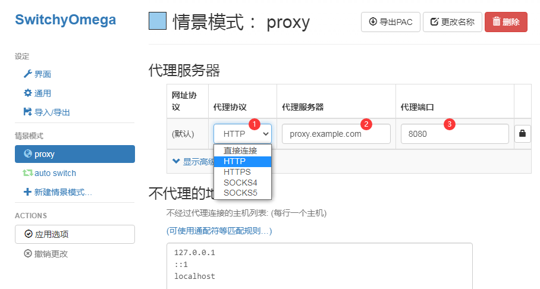
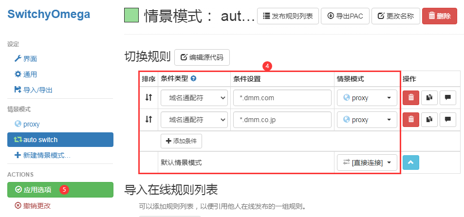
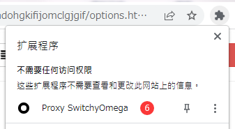
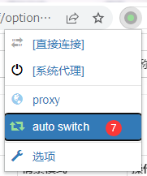
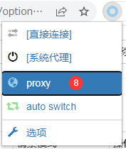
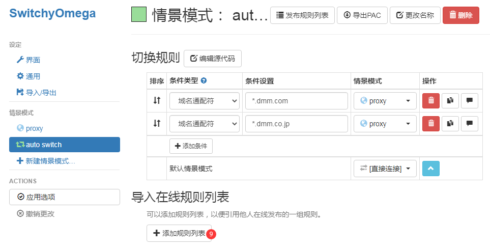
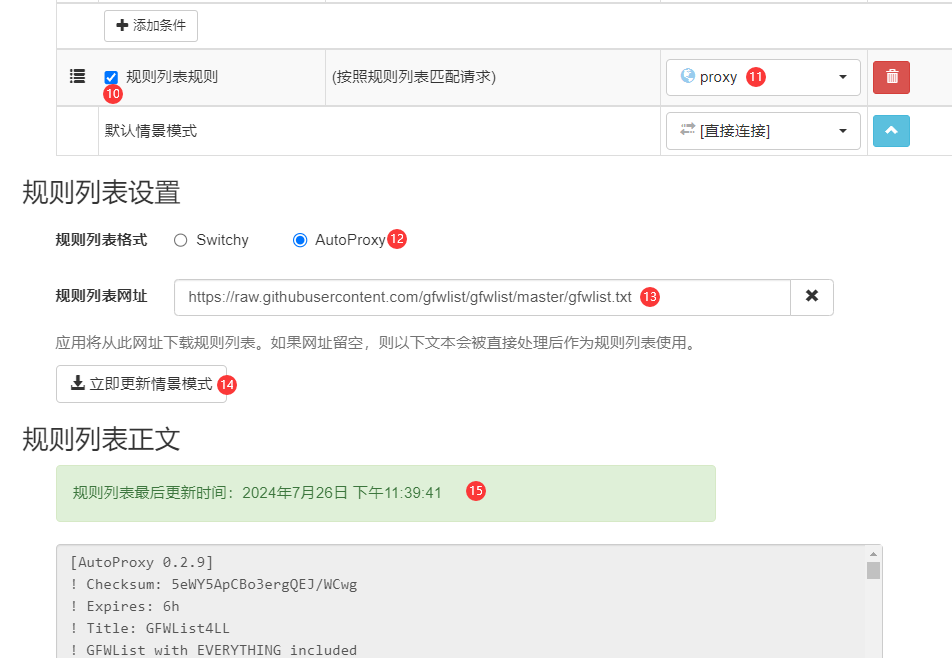

存放 Unlight: Revive 公告翻译和一些杂物的地方。

## [「Unlight: Revive」对比旧版的主要变更点](MajorChanges.md)

## 资料与攻略

- [UNLIGHT：Revive 攻略Wiki（日语）](https://unlightrevive.wikiru.jp/)

## 最新公告

[2025/01/09 定期维护公告](20250109.md)

### [2024冬 DMM GAMES FESTIVAL](https://games.dmm.com/cp/festival/winter/) 活动说明

每天签到、首次游玩列表中的游戏（包括Unlight: Revive）、完成活动页面上的任务等都能获得转盘币

1等奖：10000 pt（每天抽20位）
2等奖：250 pt（每天抽1000位）
3等奖：10 pt（每天抽140000位）
4等奖：转盘币x2
5等奖：500 pt 抽奖资格券

## [历史公告](history/)


## アレクサンドル（亚历山大城） 新匹配机制说明

### 基础规则

- 点击**クイックマッチ**（快速匹配）开始匹配

- 禁止携带怪物卡

- 仅限3vs3

- 分为4种Cost区（分区数量可能还会调整）

### 分区机制

- 分区1~3为固定Cost匹配，每周更换Cost值

- 分区4为Cost90以上±5匹配，会尽量匹配Cost接近的对手

- 不同分区的BP结算值没有区别

### 匹配机制

- 只能进入与对方BP差值不超过135的房间

- BP不足1450时，也可以进入BP比自己少135以上玩家的房间

- BP不足1500的玩家无法进入BP1600以上玩家的房间

- 不显示不满足条件的房间


## 关于禁止同IP对战的说明

2024/04/05维护禁止了同IP对战，而实际措施是开发组明确“禁止同IP的多个账号同时游玩”，目前对日本国内与其他玩家的影响是差不多的，因为游戏本体可以直连，加速器/梯子仅加速dmm部分即可，ACGP也只会加速dmm部分，如果后续游戏本体也锁区/锁IP的话，非日本玩家可能会受到非常大的影响，请各位非日本玩家谨慎投入/氪金。


## 常见问题解决方法

- 进游戏白屏

  一般最多持续30秒，超过30秒就可以刷新了，一直白屏的话可以尝试将cdn.jsdelivr.net加入梯子的代理列表

- 进游戏灰屏

  重要请求失败，只能刷新


## 其他小提示

进入战斗时，需要先读取双方的技能动画等资源，会卡一阵子黑屏/转花也是正常的。

据开发组称，目前游戏比较吃CPU和内存是引擎问题，难以解决。

手机端可以用浏览器的“桌面版”“电脑版”或其他不同名字但差不多的功能玩，但因为比较吃CPU和内存，有游戏模式的建议用游戏模式开浏览器。

实测火狐(Firefox)浏览器性能比谷歌Chrome好，推荐大家都用火狐试试（注：现在的Edge内核是Chromium也就是Chrome内核，跟直接用Chrome是差不了多少的）

Win7玩不了，因为兼容Win7的Chrome和火狐都玩不了，不过可以在虚拟机里装Win10，里面装火狐玩。

另：如果用ACGPower，则火狐与Proxy SwitchyOmega（自动切换代理插件）只能二选一，因为此插件无法在火狐上正确应用PAC代理，而ACGP必须使用PAC代理


## 可以直连的游戏服务器域名

```
xzi87byvbp6l-t8orfo5.blog
he4bliurehiufdfbl-6ae5rrg.site
trexmtgrzrm-jhrguyhqcuquyflzzbv6.site
j678bhjk8o-ydusvw4at.xyz
tn7gjezlhzm4acs9bz8s.com
```

## 必须使用日本IP访问的域名

```
dmm.com
dmm.co.jp
```

### 使用浏览器插件 Proxy SwitchyOmega 配置自动代理

<details>

<summary>展开</summary>

**首先需要确认使用的加速器/梯子有可直接使用的本地客户端（可查看端口号）或远端IP+端口/域名+端口**

安装插件： [Chrome](https://chrome.google.com/webstore/detail/padekgcemlokbadohgkifijomclgjgif) | [Firefox](https://addons.mozilla.org/firefox/addon/switchyomega/)



1. 按加速器/梯子的配置选择协议

2. 如果是本地客户端，则填入```127.0.0.1```，否则填入对应的远端IP或域名

3. 填入代理端口



4. 如图，红框部分全部按图中配置

   [条件设置]分别为 ```*.dmm.com```、```*.dmm.co.jp```

   - 如果后续进游戏一直白屏，可以在这里多添加一个 ```*.cdn.jsdelivr.net``` 试试（相同设置）

5. 应用选项



6. 找到浏览器中这个扩展程序的按钮并点击打开菜单



7. 点击auto switch切换至自动代理模式，完成。

### 稍微高级一点的配置

可以配置规则列表，让一些常见的需要加速器/梯子的网站也能够自动代理



8. 在此处点击proxy切换至proxy模式（所有流量都走加速器/梯子）



9. 添加规则列表



10. 勾选启用规则列表

11. 选择列表匹配项使用proxy（代理）模式

12. 如图

13. ```https://raw.githubusercontent.com/gfwlist/gfwlist/master/gfwlist.txt```

14. 立即更新列表

15. 确认显示绿背景色的 ```规则列表最后更新时间：xxx...``` 即成功

16. 切换回auto switch模式（图略），完成。

</details>


## 旧时代（旧版）的资料与攻略

- [旧wiki（日语）](https://wikiwiki.jp/unlight_2ch/)

- [旧wiki（中文）](https://w.atwiki.jp/unlight-fbtw/)

- <a href="//ul.kuriko.top/raid" target="_blank">Raid（涡）BOSS攻略</a>

- <a href="//ul.kuriko.top/weaponex" target="_blank">强化武器攻略</a>

