**涡(Raid)攻略 | Unlight**

<link rel="stylesheet" href="css/mdex.css" />

<link rel="stylesheet" href="css/unlight_go2top.css" />

目录

[toc]

# 主要奖励

**没打死就什么都拿不到**

## 涡1[^探1]

女王没有异矿[^图1]，其他则是发现奖励给1个异矿。

## 涡2[^探2]

妖精以外的：发现奖励给1个异矿。

妖精：有带异矿出门的和不带异矿出门的两种。

## 涡3[^探3]

与涡2相同。

## 涡4[^探4]

妖精：发现给随机魔材[^图2]和随机纹章[^图3]，排名给书签[^注1]，不给合金[^图4]，排名没有魔材和纹章。

其他：发现给书签 + 魔材，排名25以上给随机纹章，排名100以上给合金或魔材。

## 附：涡探测器来源

1、2：每日登录小几率送，月底清空。曾今暗房[^注2]能抽到探2。

3、4：氪金获得。（暂时可以无限生成）

注：α型已绝版，涡活动期间会有γ型（活动期间限定）。

## 按种类对应

|种类|HP|合金|魔材|备注|
|-|-|-|-|-|
|[妖精](#妖精)[^图5]|100|无|随机|最简单，因为只有100血|
|[海鲜](#海鲜)[^图6]|550/1000/2000|突击|弹头|第二简单|
|[虫](#虫)[^图7]|550/1000/2000|强防|戒指||
|[鱼](#鱼)[^图8]|550/1000/2000|防护|手镯||
|[龟](#龟)[^图9]|1200/6000/12000|防护|手镯|奖励跟鱼相同因此大家都不爱打皮糙肉厚的龟|
|[死兽](#死兽)[^图10]|550/3500/6000|强攻|刀身|最难打。|
|女王[^图11]|100|无|无|涡1限定，几乎等于没奖励，没人打|

# 涡BOSS共通

## 被动技能

不会受到致命伤害（即死技能及HP变动技能按HP上限20结算），不会晕眩[^buff:晕眩][^图标:晕眩]，减轻诅咒[^buff:诅咒][^图标:诅咒]效果。

[路德](https://w.atwiki.jp/unlight-fbtw/pages/245.html) 【[迷迭香](https://w.atwiki.jp/unlight-fbtw/pages/245.html#id_3b73eb7c)】换血按路德的HP上限而不是20进行结算。

[伊芙琳](https://w.atwiki.jp/unlight-fbtw/pages/278.html) 【[赤红石榴](https://w.atwiki.jp/unlight-fbtw/pages/278.html#id_a4f6be80)】的随机效果对涡BOSS有特殊处理：

|随机效果|对涡BOSS的实际效果|
|-|-|
|HP-1|HP-14|
|HP-3|HP-3|
|HP变为1|HP-140|
|HP变为5|HP-60|
|HP回满|HP+99|

## Tips

虽然妖精、海鲜、死兽都有黑格[^注3]，但它们都没带诅咒[^事件卡:诅咒]、毒杯[^事件卡:毒杯]。

白格[^注3]往往是机会4[^事件卡:机会]。

涡BOSS虽然不免疫封印[^buff:封印][^图标:封印]，但大多都有“难以被封印”效果的被动技能（获得封印异常状态的几率大幅降低）。

# 攻略中用到的M卡(怪物卡)介绍

## [妖精王妃](https://w.atwiki.jp/unlight-fbtw/pages/223.html#id_387789f7)

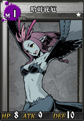 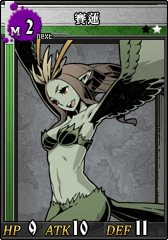 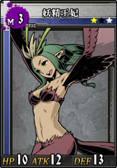

### 技能

**M1以上** 【冰结之翼】 攻击阶段 / 全距离 / 无1↑ 无1↑ / 对方「ATK↓5」（3回合）。

**M2以上** 【炼狱之翼】 防御阶段 / 全距离 / 无1↑ 无1↑ / 对方「DEF↓5」（3回合）。

**M3以上** 【混沌之翼】 移动阶段 / 全距离 / 无1↑ 无1↑ / 对方「MOV↓1」（3回合）。

M3以上1回合即可3buff上全。

### 入手

|M1哈耳庇厄|M2赛莲|M3妖精王妃|
|-|-|-|
|**魔境的胎藏** 熄灭的灯火1 **妖妇的魔道** 万苦的灯煤2 **Ex安妮莫娜[^注13]** Lv1的怪物们2 暗深森林1 风大陆的大号令1|**Ex安妮莫娜** Lv2的怪物们2 暗深森林2 风大陆的大号令2|**Ex安妮莫娜** Lv3的怪物们2 暗深森林3 风大陆的大号令3|

## [齿轮](https://w.atwiki.jp/unlight-fbtw/pages/223.html#id_8a5c3e30)

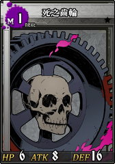 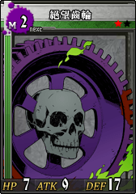 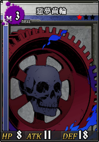

### 技能

**M1以上** 【完美之死】 防御阶段 / 近距离 / 盾3↑ / 如果即将受到的伤害在自己的当前HP以上，则对对方造成相同数值的伤害。

和泰瑞一样能反全额骰子伤害，缺点是齿轮白值DEF较高。

**M2以上** 【破坏之齿轮】 攻击阶段 / 近·中距离 / 无1↑ 无1↑ / 自己HP减半(HP减半后的尾数舍去)，本次战斗造成的骰子伤害翻倍。

砍自己半血。

会先HP减半再计算战斗伤害，1HP时发动这个技能会自杀，不再计算骰子伤害。

**M3以上** 【无限之齿轮】 攻击阶段 / 全距离 / 无1↑ 无1↑ 无1↑ / ATK+6，对方HP为最大值时攻击2次。

### 入手

|M1死之齿轮|M2绝望齿轮|M3噩梦齿轮|
|-|-|-|
|**三界的绝顶** 战栗之瞳3(BOSS) **妖妇的魔道** 致死的道路1(BOSS) **Ex天使大陆** Lv1的怪物们3 颤抖的陵墓1 颤抖的陵墓3 治愈的少女1 天使大陆的大号令1|**妖妇的魔道** 致死的道路2(BOSS) **Ex天使大陆** Lv2的怪物们3 颤抖的陵墓2 颤抖的陵墓3 治愈的少女2 天使大陆的大号令2|**妖妇的魔道** 致死的道路3(BOSS) **Ex天使大陆** Lv3的怪物们3 颤抖的陵墓3 治愈的少女3 天使大陆的大号令3|

注：***颤抖的陵墓 3*** 的齿轮在最后一格，因此无法用门[^注:门]一次性拿全三个等级的齿轮。

# 流行的打法[^注:关于推荐组]

## 妖精[^图5]

### 主要技能

面对男性角色时让对方立即死亡，面对女性角色时放弃攻击并为对方恢复HP，面对非人类时不会有反应[^注4]。因此经常会被剧透

### 打法

只有100血，几个人一人一口就没了，单刷也很快。随便打。

## 海鲜[^图6]

### 主要技能

#### 被动

HP50%以下时进入夜雾：防御阶段最多只会受到20点骰伤，移动阶段受到的伤害翻倍。

#### 主动

移动阶段 / 全距离 / 无1↑ 无1↑ 无1↑ / 获得1张特殊事件卡[^图12]：移动阶段使用，本次移动阶段技能造成的伤害+20，本事件卡数值视为20。

移动阶段 / 中·远距离 / 特2↑ / 吸收对方2HP。

使用特殊事件卡则效果变成对对方造成22伤害，自己恢复2HP。

### 打法：猫鱼

#### 推荐组（二选一）

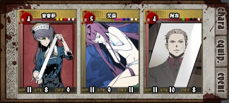

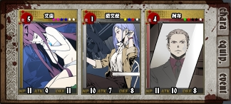

第三人为主动自杀并额外增加牌格[^注8]的角色：[音音梦](https://w.atwiki.jp/unlight-fbtw/pages/284.html)([成长状态](https://w.atwiki.jp/unlight-fbtw/pages/284.html#id_27df2e3e)中使用[秘密苦药](https://w.atwiki.jp/unlight-fbtw/pages/284.html#id_cbc59dbc))、[诺艾拉](https://w.atwiki.jp/unlight-fbtw/pages/441.html)([冲击疗法](https://w.atwiki.jp/unlight-fbtw/pages/441.html#id_40cf8723))，这两个角色都需要L5/R1以上。

#### 使用角色

L3以上猫([艾茵](https://w.atwiki.jp/unlight-fbtw/pages/52.html))，L3以上鱼哥([柯布](https://w.atwiki.jp/unlight-fbtw/pages/273.html))

#### 战斗回合数

R3以下柯布一般选择5~6回合，R4以上柯布可以选择18回合。

#### 主要使用技能

**艾茵** 【[一颗心](https://w.atwiki.jp/unlight-fbtw/pages/52.html#id_e9229e0c)】 移动阶段 / 中距离 / 特3↑ / 偷取对方手牌中数值最大的卡1张。

面对海鲜时必定能偷到特殊事件卡。

效果处理顺序为海鲜抽卡 -> 海鲜生成事件卡 -> 艾茵偷卡，因此必定能够偷到同一移动阶段内海鲜刚生成的特殊事件卡。

Ex一颗心从中距离变成全距离。

4专[^注6]可以让发动条件由特3↑降低至特2↑。

**柯布** 【[叫化盛宴](https://w.atwiki.jp/unlight-fbtw/pages/273.html#id_0954d502)】 移动阶段 / 近·中距离 / 剑4↑ 枪4↑ / 对敌方队伍随机一人造成1点伤害，重复5次。

*俗称放鱼。*

同时使用特殊事件卡将会改为造成(1+20)点伤害，重复5次合计**105点伤害**，海鲜半血以下时翻倍即合计**210点伤害**。

Ex叫化盛宴能够回收使用的牌中数值最大的牌（特殊事件卡），就是可以一张卡无限用。

**柯布** 【[酸蚀者](https://w.atwiki.jp/unlight-fbtw/pages/273.html#id_a51cf4f8)】 移动阶段 / 中·远距离 / 特2↑ / 将对方本次移动阶段发动的技能无效化，并向前移动1格。

Ex酸蚀者条件降低至特1↑ 。

让海鲜无法在移动阶段对玩家造成伤害。

#### 事件卡

以特殊为主，因为常常难以开局凑够特3[^注7]。

白格可以选择性的不插机会3[^事件卡:机会]而是改插特2。

#### 打法

艾茵偷特殊事件卡后换柯布用特殊事件卡开叫化盛宴输出。

#### 细节

被拉到中·远距离时手里要留好特2↑用于发动酸蚀者，避免被海鲜秒杀。

**别忘了放鱼的时候把特殊事件卡一起丢出去。**

## 虫[^图7]

### 主要技能

#### 被动

HP60%以下时潜伏地中（钻地）：DEF+20，在自己的攻击阶段受到的伤害变成7倍。

HP40%以下钻出来：ATK+7，受到的骰子伤害翻倍。

#### 主动

移动阶段 / 近·远距离 / 移2↑ / 将自己的出牌全部交给对方，夺取对方所有单面数值大于等于5的剑、枪卡。

移动阶段 / 全距离 / 移3↑ / 对对方造成2点伤害，这个伤害打倒敌人时，自己获得混沌[^buff:混沌][^图标:混沌]。

攻击阶段 / 近·中距离 / 无1↑ 无1↑ 无1↑ / ATK+3/4/5，每使用1张数值5以上的剑/枪卡 ATK额外+9/12/15，这次攻击不会使对方HP归0。

会触发泰瑞尔Von·541、齿轮完美之死，不会触发碧姬媞往生极乐。

攻击阶段 / 全距离 / 特3↑ / 对方「麻痹」（1回合），下回合移动阶段结束时距离与现在相同的话，对对方造成4/5/6点伤害。

### 打法：[通用打法](#通用打法)

### 打法：反弹

**注：虽然反弹打法比较轻松，但现在更流行通用打法，与反弹打法操作完全相反，请尊重涡主的选择。**

#### 推荐组

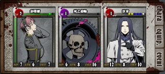

复活沃肯为卡格[^注3]担当。

#### 使用角色

L2[泰瑞尔](https://w.atwiki.jp/unlight-fbtw/pages/305.html)，[齿轮](#齿轮介绍)（等级越高，白值越高，弹的越少）。

#### 战斗回合数

任意

#### 主要使用技能

**泰瑞尔** 【[Von·541](https://w.atwiki.jp/unlight-fbtw/pages/305.html#id_a778105f)】 防御阶段 / 全距离 / 特1↑ 盾1↑ / DEF+3，这次战斗如果将会受到10点以上骰子伤害，将伤害全部反弹给对方。

[齿轮](#齿轮介绍)

#### 事件卡

插满特殊和盾。

#### 打法

最好有[狂](#狂战士)。

虫没有混沌时用L3(5血)以下的碧姬媞开场发动无缝天衣即可送混沌，之后可以路德延长也可以重送。

主动拉近，主动送数值5以上的剑、枪卡。

### 推荐组2（反弹）

只上MOV↓9。也可以多上个DEF↓9方便雷牌。

用[里卡穿](#里卡穿)将穿穿换成L2泰瑞尔，卡中距离雷完牌造好剑4之后再送混沌，然后拉近造剑9，造剑9时顺便扔出移2给虫，下回合换泰瑞，剑9会全部被夺走，直接弹。

## 鱼[^图8]

### 主要技能

#### 主动

移动阶段 / 全距离 / 移3↑ / 自己与对方各抽1~3/3/4张卡，对方先抽。

攻击阶段 / 全距离 / 无1↑ 无1↑ 无1↑ / 这次战斗造成的伤害小于等于5时，对方手牌数值上升2/2/3，否则数值下降1/2/3，最多改变7张卡。

### 打法：[通用打法](#通用打法)

## 龟[^图9]

### 主要技能

#### 被动

HP1/3以下时隐身：DEF+15，在自己的攻击阶段受到的伤害变成5倍。

#### 主动

移动阶段 / 全距离 / 移1= / 随机一种双面数值3的事件卡，发给自己和对方各2/2/3张。

防御阶段 / 近距离 / 盾3= 盾3= / DEF+盾数值×3/4/4，自身麻痹1回合。

### 打法：[通用打法](#通用打法)

### 打法：[里卡穿](#里卡穿)

也可以把里卡穿组的穿穿[^外号:穿穿]换成R4以上闪闪[^外号:闪闪]并带上龟锤[^注10]，能提高50%输出。

### 打法：反伤（HP1/3以下）

#### 推荐组

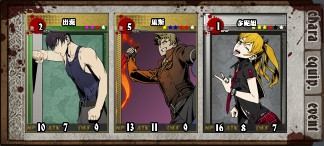

复活多妮妲为卡格[^注3]担当。

#### 使用角色

L4以上[出叶](https://w.atwiki.jp/unlight-fbtw/pages/377.html)，R5[里斯](https://w.atwiki.jp/unlight-fbtw/pages/163.html)。

#### 特殊需求

最好出叶和里斯都有龟锤[^注10]，里斯没有龟锤的话可以直接用[复活里斯](https://w.atwiki.jp/unlight-fbtw/pages/494.html)。

#### 战斗回合数

任意

#### 主要使用技能

**出叶** 【[潜影迷雾](https://w.atwiki.jp/unlight-fbtw/pages/377.html#id_5c09a766)】 移动阶段 / 全距离 / 特1↑ / 改为用手牌中的移动卡计算移动力，移动力+1。出了移动卡则必定后手。1回合内潜入雾中。

**出叶** 【[波环纹脉](https://w.atwiki.jp/unlight-fbtw/pages/377.html#id_cedd5a0c)】 防御阶段 / 全距离 / 无1↑ / 跟对方出了相同卡片时，DEF+相同张数×5。防御成功时对对方造成相同张数+4点伤害。

需要也只需要双面类型与数值相同，是公牌还是事件卡无所谓。

**R5里斯** 【[Ex烧灭](https://w.atwiki.jp/unlight-fbtw/pages/163.html#id_760b37a7)】 防御阶段 / 近·中距离 / 特3↑ / 破坏对方所有手牌，造成破坏张数×2的伤害。

**复活里斯** 【[焰凰](https://w.atwiki.jp/unlight-fbtw/pages/494.html#id_11c98b23)】 防御阶段 / 近·中距离 / 特3↑ / 破坏对方所有手牌，造成破坏张数×2的伤害，恢复破坏张数×2的HP。

#### 事件卡

插满特殊。

#### 打法

出叶特1抢后攻并选择换人，看龟发的事件卡是否是龟当前距离能够使用的类型，是能够使用的类型或手卡剩余特不足特3就不换人，等待龟出卡后扔出相同的卡，发动波环纹脉造成伤害，否则换里斯发动Ex烧灭(R5)/焰凰(复活)。

## 死兽[^图10]

### 主要技能

#### 被动

随机发动解放：解除自身的封印[^buff:封印][^图标:封印]状态。

现实时间10~19分、40~49分硬化：受到的物理伤害降低至1/4（尾数舍去），受到的特殊伤害翻倍。

现实时间20~29分、50~59分吸收：吸收对方的特殊攻击，并恢复自己最多5HP，受到的物理伤害翻倍。

硬化和吸收只影响发动攻击技能时造成的骰子伤害，反伤技能、直伤不受影响，具体技能分类见[物理技能与特殊技能](#物理技能与特殊技能)。

一般普通攻击为物理伤害，物理伤害技能与特殊伤害技能同时发动则最终伤害不受硬化和吸收影响，但吸收时死兽还是会回血。

#### 主动

移动阶段 / 近·中距离 / 移2↑ / 取消对方的移动。

攻击阶段 / 全距离 / 无1↑ 无1↑ 无1↑ / 将自己的异常状态全部转移给对方。

此技能发动成功时，即使导致发动的玩家并没有看到相应的buff，死兽身上的buff也会全部消失，因此建议在有人准备里卡穿时舔死兽的玩家全部进场拿到进场分就F5刷新页面退出涡战斗。

### 给死兽贴上[狂战士](#狂战士)

见[buff组](#全buff辅助组)。

### 打法：[通用打法](#通用打法)

### 打法：[里卡穿](#里卡穿)

## 通用打法

除了海鲜以外都可以用的方法。

1. 给涡BOSS贴上buff(异常状态)，通常必上[39](#buff39) + [狂战士](#狂战士)，虫必上[傀儡](#傀儡)
2. 不断延长刷新buff持续时间
3. 硬揍（按着打）

这些操作不需要同一个人完成，当然也可以同一个人完成。

### 给涡BOSS上buff(异常状态)

涡的buff不是按回合，而是按现实时间的分钟计算持续，获得buff时会按1回合=1分钟换算为分钟，最大持续时间上限为9分钟。

获得buff时实际上是获得了一个X分钟持续时间上限的buff，每次重新贴上(覆盖，或者叫顶掉)都会改写这个上限并刷新持续时间至当前上限。不会覆盖旧buff的技能则是直接刷新持续时间。延长则是增加上限并刷新持续。

### 延长buff持续时间

使用L3以上[路德](https://w.atwiki.jp/unlight-fbtw/pages/245.html)店长。

**路德** 【[紫罗兰](https://w.atwiki.jp/unlight-fbtw/pages/245.html#id_5e261ff3)】 移动阶段 / 全距离 / 无1↑ 无1↑ 无1↑ / 给予对方随机2~3个异常状态。

**绝对不要发动此技能**

因此路德最多只能在移动阶段出2张牌。

否则有可能会贴上恐惧[^buff:恐惧][^图标:恐惧]、覆盖掉[39](#buff39)。

**路德** 【[洋地黄](https://w.atwiki.jp/unlight-fbtw/pages/245.html#id_e19e2fd3)】 攻击阶段 / 全距离 / 剑3↑ 枪3↑ / 对方所有异常状态无论好坏，持续时间全部延长2回合。

也会延长自坏[^buff:自坏][^图标:自坏]。

对涡BOSS就是延长2分钟。

Ex洋地黄提高到延长3回合（3分钟）。

4专[^注6]可以将发动条件降低至 剑2↑ 枪2↑ 。

对于非100%成功的buff：延长成功率与重上成功率相同。

#### 39，或者叫999

指ATK↓9[^buff:ATK↓][^图标:ATK↓]、DEF↓9[^buff:DEF↓][^图标:DEF↓]、MOV↓9[^buff:MOV↓][^图标:MOV↓]

最重要的是MOV↓9：部分涡BOSS会刷新自己的麻痹[^buff:麻痹][^图标:麻痹]状态，因此通用做法是不使用麻痹而是用MOV↓9来使涡BOSS的移动力归0。

使用任何能够快速使对方获得**任意数值**的这三个buff的角色或怪物卡 + L5/R1以上[泰瑞尔](https://w.atwiki.jp/unlight-fbtw/pages/305.html)。

可以使用M3[妖精王妃](https://w.atwiki.jp/unlight-fbtw/pages/223.html#id_387789f7)、R1[弗雷特里西](https://w.atwiki.jp/unlight-fbtw/pages/55.html)([修罗架势](https://w.atwiki.jp/unlight-fbtw/pages/55.html#id_a6a10ab0))、[弗雷特里西(N)](https://w.atwiki.jp/unlight-fbtw/pages/373.html)[^N卡]\([修罗的奥义](https://w.atwiki.jp/unlight-fbtw/pages/373.html#id_1877fd93))。

也可以直接用泰瑞尔（就是看脸，因为很容易吸到重复的）。

**泰瑞尔** 【[Rud·913](https://w.atwiki.jp/unlight-fbtw/pages/305.html#id_538dd175)】 攻击阶段 / 近距离 / 剑4↑ 移1↑ / ATK+5~10，移动到远距离。

**泰瑞尔** 【[Chr·799](https://w.atwiki.jp/unlight-fbtw/pages/305.html#id_c74e5cf9)】 攻击阶段 / 中·远距离 / 枪2↑ 特2↑ / 吸收对方ATK·DEF·MOV中随机一种能力。

实际效果是自己获得能力上升，对方获得能力下降的buff。

会覆盖掉旧buff，使其数值和持续时间变为此技能效果的数值和持续时间。

**泰瑞尔** 【[Wil·846](https://w.atwiki.jp/unlight-fbtw/pages/305.html#id_1fcc0fe5)】 攻击阶段 / 远距离 / 剑3↑ 枪3↑ / 使双方的ATK·DEF·MOV状态，无论上升下降，强度(数值)全部变为9。

在对方同时有任意数值的ATK↓ + DEF↓ + MOV↓时发动即可使其变为ATK↓9 + DEF↓9 + MOV↓9。

不会覆盖旧buff：不会刷新剩余回合数，但对涡BOSS会刷新buff持续时间。

与Chr·799同时发动会先吸取能力（为双方添加buff）再将buff数值全部变为9。

因为效果是把数值变成999，所以也把这个技能叫作999。

#### 狂战士[^buff:狂战士][^图标:狂战士]

使用R4以上[玛格丽特](https://w.atwiki.jp/unlight-fbtw/pages/56.html)/[玛格丽特(N)](https://w.atwiki.jp/unlight-fbtw/pages/413.html)[^N卡]

**玛格丽特** 【[Ex末日幻影](https://w.atwiki.jp/unlight-fbtw/pages/56.html#id_0b66e462)】 移动阶段 / 全距离 / 剑1↑ 枪1↑ / 根据移动后的距离使对方获得异常状态（5~6回合）。

移动到远距离时对方「狂战士」。

非Ex的末日幻影不能出移动卡，嫌麻烦就用N卡吧。

N玛格丽特还会无视距离额外给对方「中毒」。

**无论如何都不要移动到近距离（使对方「恐惧」）。**

#### 傀儡[^buff:傀儡][^图标:傀儡]

使用L3以上[维若妮卡](https://w.atwiki.jp/unlight-fbtw/pages/466.html)

**维若妮卡** 【[剧毒人偶](https://w.atwiki.jp/unlight-fbtw/pages/466.html#id_95d1a46e)】 攻击阶段 / 中·远距离 / 枪4↑ / ATK+3，布偶+1，攻击成功时对方「中毒」（3回合）。

布偶：最多3个，不属于异常状态，换下场也会保留，在每次攻击力不为0的攻击结算后对对方造成布偶数量×1点伤害，每次受到骰子伤害时失去一个。

**维若妮卡** 【[人偶幻视](https://w.atwiki.jp/unlight-fbtw/pages/466.html#id_eb09214f)】 防御阶段 / 近·中距离 / 特2↑ 盾3↑ / DEF+2~3+布偶数×3，有3个布偶时HP+3、布偶数归0、对方「傀儡」（3回合）。技能使用后布偶+1。

必须发动技能前已经有3个布偶才能成功给对方贴上傀儡。

4专[^注6]可以将人偶幻视的发动条件降低至 特1↑ 盾2↑ 。

最快2回合即可贴上：卡中距离，第一回合各发动一次，布偶+2，第二回合抢先攻发动剧毒人偶布偶+1=3。

**打虫必上**：阻止它获得混沌[^buff:混沌][^图标:混沌]、夺取玩家手牌。

#### 诅咒[^buff:诅咒][^图标:诅咒]

涡BOSS大多都有能力打出不低的骰子伤害靠它的机会4，诅咒可以有效提高己方生存率。

#### 能力低下[^buff:能力低下][^图标:能力低下]

在涡BOSS身上时没有层数，只会将层数转化为持续时间分钟数，效果强度固定为满层效果（ATK-9 DEF-9）。

效果足够强力，只是不太好上（只能用[威廉](https://w.atwiki.jp/unlight-fbtw/pages/314.html)）。

#### 其他可选异常状态

持续造成伤害：中毒[^buff:中毒][^图标:毒]、猛毒[^buff:猛毒][^图标:猛毒]、咒缚[^buff:咒缚][^图标:咒缚]。

封印[^buff:封印][^图标:封印]：效果很强力，但涡BOSS大多都有“难以被封印”效果的被动技能，大幅降低了被封印的几率。

麻痹[^buff:麻痹][^图标:麻痹]：一些涡BOSS会刷新自己的麻痹状态，使持续时间大幅缩短，因此不如MOV↓9。

断绝[^buff:断绝][^图标:断绝]：阻止涡BOSS回血。

自坏[^buff:自坏][^图标:自坏]：往往完全无法造成伤害就没了。

标靶[^buff:标靶][^图标:标靶]：克洛维斯专用buff。

### 推荐组：一个人也做得到的全buff辅助组

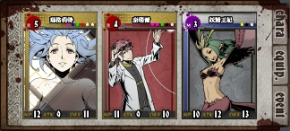

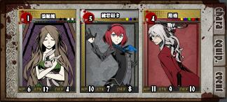

#### 使用角色

玛格泰瑞组（39狂战组）：R5玛格丽特，R4泰瑞尔，M3[妖精王妃](#妖精王妃介绍)。（低配：N玛格丽特，L5/R1泰瑞尔，M3妖精王妃）

路德组（傀儡&延长组）：任意开场抽卡角色，L5维若妮卡，R4路德。（低配：L4/R1碧姬媞，L3维若妮卡，L3路德）

#### 战斗回合数

见打法

#### 事件卡

玛格泰瑞组：插满机会、移动、特殊。

路德组：插满机会、特殊、盾。

#### 打法

玛格泰瑞组4~6回合入场。

开场换妖精王妃上ATK↓和DEF↓，在移动阶段发动技能上MOV↓同时换泰瑞尔上场。

泰瑞尔全力防守、拉远，尽可能地发动999，牌够的话还可以顺便吸一下，buff持续时间会更长。

999成功发动后立即刷新重进（可以事先开好第二个页面）。发动成功的回合，涡BOSS身上**显示的**数值不会改变，实际上已经变了，只是必须等到下回合才会更新显示。因此只要看到3buff的持续时间都刷新了就是999成功了。

换路德组，1回合入场延长1次。带路德的延长组建议放一个能开场抽卡的角色在第一位，开场抽卡 + 尽可能地抢先攻 + 换路德上场。

* 如果是打虫：5~6回合入场，换维若妮卡攒布偶上傀儡，记得延长buff。如果维若妮卡在别的组，那么需要先上路德延长1~2次，然后维若妮卡3回合入场上傀儡，上了之后还要再延长。

换回玛格泰瑞组，1回合入场，玛格丽特上狂。

换路德组，延长至9分钟。

之后每隔7分钟左右延长一次即可。

#### 细节

路德**绝对不能**在移动阶段出3张以上的牌发动紫罗兰，否则可能会功亏一篑。

持续时间为 **在这回合消灭** 的buff也是能够延长的。

#### 细节：打死兽

死兽只需要贴狂战。

*死兽近中距离 移2↑ 能取消对方的移动，导致上狂变得非常困难。*

##### 一般做法

玛格泰瑞组5~8回合入场，开场换泰瑞等待死兽主动拉远，也可以在近距离时发动Rud·913移动到远距离，并在下回合移动阶段选择换人，根据移动阶段移动到的距离决定是否换玛格上场。

玛格在远距离上场后，手牌留剑1↑ 枪1↑各一张和所有移动卡，下回合全力拉远。

上了狂之后不要马上F5离场，因为狂战经常会在刚上去的时间点又被其他人接走，建议等一回合确认输出组狂战到账后再F5离场，此时还在远距离所以即使没有到账也能比较容易的再上一次。

##### 特殊做法（不常见）

* 先想办法上个封印再玛格泰瑞1回合上狂。
* 硬化时跟输出组一样带N艾伯雷牌，拖条等到需要狂战的时候再上。

### 刮痧输出：齿轮

#### 推荐组

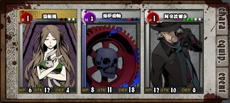

R1碧姬媞可以换R3，只是个人比较喜欢用R1，阿奇波尔多(N)[^N卡]为卡格[^注3]担当（3绿2白）。

*R1哔叽 + M3齿轮推地图很快，齿轮带上 20级通武[^注5]能秒大多数怪物以及地图 BOSS 。*

#### 使用角色

任意开场可以额外抽卡的角色 + M3[噩梦齿轮](#齿轮介绍)。

#### 战斗回合数

一般选择1回合。

#### 事件卡

白格[^注3]插满机会3[^事件卡:机会]，剩下插满枪卡。

#### 打法

抽卡角色推荐[碧姬媞](https://w.atwiki.jp/unlight-fbtw/pages/288.html)、[梅丽](https://w.atwiki.jp/unlight-fbtw/pages/315.html)。

开场抽卡之后换齿轮输出。

#### 细节：打虫

开场抽卡选择碧姬媞的话，注意要带6血以上的碧姬媞（比如R1），否则会被秒，1回合什么都干不了就立即结束，还会给虫送混沌[^buff:混沌][^图标:混沌]。

### 输出：瑟法斯

#### 使用角色

[艾伯李斯特(N)](https://w.atwiki.jp/unlight-fbtw/pages/315.html)[^N卡] + L5/R1以上[瑟法斯](https://w.atwiki.jp/unlight-fbtw/pages/457.html)。

#### 战斗回合数

18回合。

#### 主要使用的技能

**艾伯李斯特(N)** 【[帝国战术](https://w.atwiki.jp/unlight-fbtw/pages/320.html#id_2c2e4dc0)】 被动 / 移动阶段 / 回合开始时额外抽2张卡。

**艾伯李斯特(N)** 【[紫电](https://w.atwiki.jp/unlight-fbtw/pages/320.html#id_a008c84e)】 攻击阶段 / 近·中距离 / 剑4↑ 特3↑ / ATK+7，丢弃对方与造成伤害值相同数量的手牌，自己抽取等量的卡。

对人时是抽取与丢弃数量相同的卡，对怪物时是抽取与造成伤害值相同数量的卡。

公牌总数依场景不同为42~57张，在涡BOSS有狂战士的情况下，只要3回合平均每回合战斗打穿10正骰即可总共抽60张卡，达成抽光公牌。

**瑟法斯** 【[勇猛的仪式](https://w.atwiki.jp/unlight-fbtw/pages/457.html#id_327ebf4c)】 攻击阶段 / 近·中距离 / 剑4↑ / ATK+5+双方手牌数量差×2。

**瑟法斯** 【[猎豹之剑](https://w.atwiki.jp/unlight-fbtw/pages/457.html#id_bd3ea38f)】 攻击阶段 / 近距离 / 剑4↑ 特2↑ / ATK+出牌张数，自己出牌比对方多2张以上时攻击2次。

2次攻击伤害相加。

#### 装备需求

艾伯需要强化了一定的近攻和近防数值的通武[^注5]，没有的话雷牌[^注9]效率会非常低，建议换其他组。

瑟法斯最好能有4专[^注6]。

数值都是越高越好。

最好在有MOV↓9 + 狂战士之后再入场。

#### 事件卡

白格插满机会3，剩下的插满特、绑特的剑[^双面卡]。

#### 打法

开场拉到近距离抢先手雷牌，抽干公牌后换瑟法斯，每回合只出2张卡：剑4↑，特2↑ 。

尽量优先使用事件卡，因为事件卡不会进入弃牌堆所以不会被涡BOSS下回合抽到。

用掉2~3张公牌的剑卡后就可以准备换回艾伯重新雷牌了。

#### 细节

为什么要近距离雷牌：虽然紫电是近中距离，但中距离得出枪卡才有攻击力，产生额外的牌耗增加回收难度。因此通武[^注5]也是选择近攻的。

当前阶段**使用**的卡在阶段结束后才会进入弃牌堆，因此紫电无法回收发动紫电时使用的卡，也无法回收涡BOSS防御时使用的卡。

可以只使用事件卡发动紫电，或是抢先攻雷牌，在下一个阶段（即当回合防御阶段）用机会3[^事件卡:机会]抽回来。

最后一回合（自行视情况判断）可以把手里的所有数值2以上的剑都丢出去（其他牌不能丢，不然会失去手牌差的攻击力加成），输出能高一点。

涡BOSS防御时使用的卡只能用机会3回收。因此应尽量不使用绑盾的剑卡[^双面卡]。

雷完牌后回收涡BOSS手里的盾卡的方法（只能用机会3）

* 盾卡绑移：期待涡BOSS在移动阶段丢出来，在下一阶段用机会3回收。
* 盾卡绑剑且后攻则可以期待涡BOSS把盾作为剑丢出来，在下一阶段用机会3回收。
* 其他情况：先攻：只用事件卡攻击，到自己防御阶段时用机会3回收涡BOSS刚使用的盾卡。（用公牌攻击也可以，只是公牌还得另行回收）

#### 细节：打虫

公牌抽干后不要让虫拿到特3↑，否则会被麻痹+大出血（尽量用事件卡的特2、特3）

虫拿到3张剑卡就能爆攻，所以尽量用剑4或事件卡的剑4/剑5/剑6，虫拿到第三张剑的时候就可以准备再雷一次牌了，如果虫已经拿到了至少1张剑5以上数值的剑卡，那么虫拿到第二张剑的时候就可以准备再雷一次牌了，不然瑟法斯很容易死。

#### 细节：打鱼

不要让鱼拿到盾2↑，否则会难以回收自己使用的卡，以及会出掷骰动画很浪费时间。

#### 细节：打死兽

因为死兽被动必定是先硬化再吸收，因此可以在硬化时入场，用特殊伤害的紫电雷好牌后拖条等到吸收再开始输出。

只不过因为无法重新雷牌，所以打不了多少回合输出。

#### 推荐组

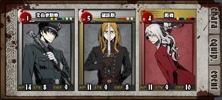

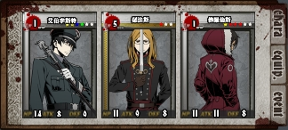

第三人带路德可以边打边延长buff，而佛罗伦斯(N)则是卡格[^注3]担当（3红2白）。

### 进阶输出：里卡穿

#### 使用角色

[艾伯李斯特(N)](https://w.atwiki.jp/unlight-fbtw/pages/315.html)[^N卡]，L3以上[里卡多](https://w.atwiki.jp/unlight-fbtw/pages/471.html)，[弗雷特里西(N)](https://w.atwiki.jp/unlight-fbtw/pages/373.html)[^外号:穿穿]。

#### 战斗回合数

18回合

#### 主要使用的技能

**里卡多** 【[威势](https://w.atwiki.jp/unlight-fbtw/pages/471.html#id_a459381d)】 防御阶段 / 近·中距离 / 盾3↑ / 将手牌中数值3以下的剑卡数值上升1。

所有符合条件的卡都会被改变，事件卡除外。事件卡数值不会被任何技能改变。

被改变的卡在使用过后就会被还原。

**里卡多** 【[痛打](https://w.atwiki.jp/unlight-fbtw/pages/471.html#id_6919f9ea)】 攻击阶段 / 近·中距离 / 剑3↑ / 将手牌中数值4~5的剑卡数值变成6。

规则同威势。

**里卡多** 【[如意](https://w.atwiki.jp/unlight-fbtw/pages/471.html#id_f5d2508d)】 攻击阶段 / 近距离 / 剑6= / 将手牌中数值为6的剑卡数值变成9，攻击成功时对方手牌数值全部下降1。

规则同威势。

最低只会减到1。

与痛打一起发动则会先将4~5的剑卡变为剑6，再将剑6变为剑9。

**弗雷特里西(N)** 【[十穿](https://w.atwiki.jp/unlight-fbtw/pages/373.html#id_225306fa)】 攻击阶段 / 全距离 / 剑3↑ 枪3↑ 移1↑ / 对对方造成1点伤害，自己获得「ATK+6」或「DEF+6」（3回合）。

连续发动时会优先获得自己身上还没有的状态，其次是优先持续时间较短的状态。

**弗雷特里西(N)** 【[百穿](https://w.atwiki.jp/unlight-fbtw/pages/373.html#id_213954b4)】 攻击阶段 / 近距离 / 剑6↑ 枪0= 移0= / ATK+5，自身ATK或DEF上升时攻击2~3次，两者都有上升时攻击5次。

5次攻击伤害相加。

**弗雷特里西(N)** 【[罗刹架势](https://w.atwiki.jp/unlight-fbtw/pages/373.html#id_bc7cb0d1)】 移动阶段 / 全距离 / 特3↑ / 本回合中，自己出的剑卡以外的卡无效化，造成的骰子伤害翻倍。

这个状态下出枪和移也不会影响百穿发动，也无法发动十穿。

**弗雷特里西(N)** 【[修罗的奥义](https://w.atwiki.jp/unlight-fbtw/pages/373.html#id_1877fd93)】 被动 / 防御阶段 / 自己HP变成4以下时，HP+3、对方「ATK-4」「DEF-4」「MOV-1」（2回合）。

这个技能往往是翻车点，因为会覆盖掉39，需要注意**避免发动**这个效果。

#### 装备需求

艾伯需要全数值尽可能高的通武[^注5]。数值不够影响雷牌效率。

里卡多需要近防、远防尽可能高的通武或4专[^注6]。数值不够则可能剑9还没造好就死了。

穿穿需要近攻尽可能高的通武。

#### 事件卡

红格剑6，白格机会3，黄格特3，紫格移3特3，绿格枪5剑3，剩下的剑3移1、剑3特1。

#### 打法

开场按瑟法组的方法雷牌。

雷完牌换里卡多，多回合造剑4。

造好剑4后拉到近距离，攻击阶段使用剑6（尽量使用事件卡）将手牌里的剑4~6全部变成剑9。

换穿穿，2次十穿后移动阶段开罗刹架势 + 拉到近距离。

可以在上面的步骤中先将剑卡全部旋转到剑朝上，最后出牌的时候比较快。

攻击阶段扔出所有剑卡。

没打死的话可以在本回合最后一个阶段将剩余的无用手牌全部扔掉，下回合再次尝试罗刹架势 + 拉近百穿。

#### 细节

造剑9时使用的剑6如果是公牌，那么会下回合被涡BOSS抽走，除非先攻造好后在防御阶段用机会3回收，使用事件卡可以降低翻车率。

造好剑9后可以看情况用机会3回收盾卡，变相降低涡BOSS防御，提高输出，甚至跳过5百穿动画。

穿穿的通武防御数值高的话可以第1或第2回合先换穿穿开一次十穿，可以减少雷完牌后的暖机总共使用的牌数，也就是减少会被涡BOSS抽走的牌数，降低翻车率。

盾尽量用绑移[^双面卡]的，涡BOSS喜欢把绑移的盾在移动阶段丢出来。

#### 细节：打虫

虫必须有傀儡buff。

不要让虫拿到特3↑，不然容易剑9还没造好里卡多就先死了。

所以造剑9时盾用绑移的而不是绑特的，或事件卡。

所以穿穿暖机时也尽量用绑移的剑/枪而不是绑特的。

#### 细节：打死兽

里卡穿打死兽是可以一刀砍死6000HP死兽的，前提是需要两个狂战。

第一个狂战在里卡穿入场前上，上了之后里卡穿入场，开场换穿穿，让死兽【引流】将第一个狂战士转移到穿穿身上（也就是接走狂战），此时可以顺便发动一次十穿提前热机[^注11]一半。

第二个狂战在剑9造好后。热机完成前拖条[^注12]等待狂战，通常是会要配合到20分或50分准时上的，尽量通过拖条调整进入下一回合的时间。

有双狂战的情况下的极限：300攻（左右）×5百穿×罗刹架势2倍×双狂战4倍×吸收2倍=实际等于约24000攻击力。

10分或40分入场雷牌（也可以提前几分钟）。

雷完牌拖条到20分或50分，并且等第二个狂战到账后确认死兽的被动技能状态为【吸收】再开罗刹架势输出。

30分或00分前必须出刀，否则输出损失太大。

**死兽事件卡有移1**，不要让死兽拿到移2↑，否则会无法控制距离，因此造剑9时盾卡用纯盾、事件卡盾、盾特，最多只能使用1张公牌盾移（用了就会加大翻车几率），除非有机会3可以回收。

移动阶段等10秒再确定，因为涡BOSS也会拖条。拖条移2拉远就为了躲你的罗刹架势

穿穿热机尽量用事件卡的剑3移1，实在没有就等到机会3再换穿穿并开始热机，用机会3回收移动。

# 物理技能与特殊技能

(N)：[^N卡]
数据来源：[Google表格](https://docs.google.com/spreadsheets/d/1FK2RjusX2bHdAusvWapk8ZFJtnYUTs4h0yhtnQHxXSE/edit#gid=2043573874)

## 物理技能

|来自|技能|||
|-|-|-|-|
|艾伯李斯特|精密射擊|||
|艾依查庫|連射|神速之劍|憤怒一擊|
|古魯瓦爾多|猛擊|||
|阿貝爾|霸王閃擊|閃電旋風刺|幻影劍舞|
|利恩|劫影攻擊|毒牙|背刺|
|阿奇波爾多|致命槍擊|劫影攻擊||
|馬庫斯|彈射飛刀|||
|布列依斯|封印枷鎖|||
|雪莉|飛刃雨|||
|弗雷特里西|一閃|十閃|百閃|
|弗雷特里西(N)|十穿|百穿||
|瑪格莉特|地獄獵心獸|||
|史普拉多|貪食者|||
|史普拉多(N)|敬重者|||
|貝琳達(N)|告死從僕|溶魂風暴||
|艾妲|機槍掃射|熱導引機||
|艾妲(N)|代碼‧Exceed|||
|薩爾卡多|吊殺絞刑|迴飛踢||
|米利安|高地爆擊|||
|佛羅倫斯|戰鬥巨斧|支援砲擊||
|佛羅倫斯|戰鬥巨斧改|||
|帕茉|靜謐之背|||
|阿修羅|燕飛|弦月||
|布朗寧|馬德里布魯的喧囂|亞細亞的曙光||
|瑪爾瑟斯|深紅之月|||
|路德|向日葵|洋地黃||
|魯卡|絕塵劍|||
|史塔夏|愚者之手|||
|C.C.|白銀戰機|||
|柯布|天鵝絕唱|||
|康拉德|無上之怒|極致復仇||
|碧姬媞|轉生輪迴|||
|泰瑞爾|Rud‧913|||
|露緹亞|腐朽之靈|||
|梅莉|夢境搖籃|||
|尤莉卡|奸佞的鐵鎚|||
|娜汀|夜雨磅礡|墜落流星||
|迪諾|沉醉在本大爺的劍術之中吧！|這才是本大爺真正的實力！||
|奧蘭|大鬧一番|||
|希拉莉|報復回擊|惡意祈願||
|克洛維斯|靈幻的鋼彈|終極的烈彈||
|艾莉絲泰莉雅|陷落常春藤|惡意贈禮||
|雨果|縫影|適應變化|盜賊的神技|
|艾莉亞娜|患病的原理|||
|格雷高爾|I Choose You（狂亂）|||
|蕾塔|羅恩格林之門|繚亂舞刃||
|依普西隆|次元牽引|||
|波蕾特|撩亂射擊|紫色狂躁|亂彈掃射|
|諾艾菈|隼鷹標槍|強襲彗星||
|勞爾|陷阱追擊|||
|潔米|海普利斯|||
|瑟法斯|勇猛的儀式|獵豹之劍||
|維若妮卡|劇毒人偶|危險人偶|人偶廢棄|
|里卡多|痛打|如意|脅嚇|
|瑪麗妮菈|快速射擊|||
|摩根|感覺共有|攻勢轉化||
|茱蒂絲|多向集三|高速迴旋||
|惡夢齒輪|破壞的齒輪|無限的齒輪||
|飛龍|咆哮|||
|畢雷亞|擺盪小刀雜技|||
|渦的觀測者|絕殺射擊|||
|屍龍|龍拳|亂舞||
|雙頭犬|雙頭擊|||

## 特殊技能

|来自|技能|||
|-|-|-|-|
|艾伯李斯特|雷擊|||
|艾伯李斯特(N)|紫電|||
|古魯瓦爾多(N)|血腥哀號|||
|利恩(N)|紅月|||
|庫勒尼西|深淵|||
|庫勒尼西|黑暗漩渦|||
|傑多|因果之幻|||
|阿奇波爾多(N)|調和烈酒|致命燃燒彈||
|布列依斯|降魔之光|||
|布列依斯(N)|斷罪的燐光(N)|||
|雪莉|自殺傾向|||
|雪莉(N)|自殺謬誤(N)|||
|艾茵|十三隻眼|||
|伯恩哈德|解放劍|咒劍||
|伯恩哈德(N)|獄劍|||
|瑪格莉特|月光|||
|瑪格莉特(N)|世界創織者|||
|多妮妲|殘虐傾向|律死擊||
|多妮妲(N)|災害投擲|||
|貝琳達|裂地冰牙|溶魂之雨||
|羅索|超量負荷|時空分斷刀|地獄喪鐘|
|艾妲(N)|雷射加農砲|||
|梅倫|Lowball|Gamble||
|蕾格烈芙|C.T.L|B.P.A||
|里斯|劫火|煉獄||
|里斯(N)|紅炎|||
|米利安|漆黑迅雷|||
|佛羅倫斯|MOAB|||
|瑪爾瑟斯|漆黑太陽|||
|路德|迷迭香|||
|魯卡|夢幻|||
|史塔夏|命運的鐵門|||
|沃蘭德|夢|||
|C.C.|高頻電磁手術刀|||
|伊芙琳|紅蓮車輪|||
|布勞|時間爆彈|||
|凱倫貝克|終局的圓舞曲|恩仇的鎮魂曲||
|音音夢|愉快抽血|||
|庫恩|懶惰的呻吟|挫折的騷音||
|夏洛特|冬之夢|||
|泰瑞爾|Chr‧799|Wil‧846||
|露緹亞|渦騎劍閃|||
|威廉|魂魄的奉禮|||
|梅莉|夢幻魔杖|||
|古斯塔夫|鮮明的邪光|冒瀆的詛咒|絕命的盡頭|
|林奈烏斯|蝶舞|||
|奧蘭|跳火圈|||
|諾伊庫洛姆|永恆之白|萬物之杖||
|出葉|銳水流槍|厄毒邪雨||
|艾莉亞娜|殘酷的最終定理|||
|格雷高爾|I Choose You（追憶）|I Choose You（引流）|創贈麻煩|
|依普西隆|次元侵奪|||
|尤哈尼|燦爛光刃|||
|勞爾|恐慌榴彈|||
|潔米|瑪基斯托|||
|無名者|惡靈之魂|冥王之魂||
|梅芙|惡魔之尾|迷魂之眼||
|土星貓|不溶之冰|不滅之炎||
|飛龍|火炎吐息|||
|聖母像|連鎖離子電|怒鳴強雷||
|聖櫃|魔化|||
|畢雷亞|噴火雜技|||
|妖精王妃|冰結之翼|||
|侯月鬼|邪惡的微笑|||
|虛神|虛空之穴|無之波動||
|雙頭犬|劫影咆哮|||
|莉莉|紡織之陽|嘆息轉換||

## 无分类（不受硬化和吸收影响）

|来自|技能|
|-|-|
|馬庫斯|自爆|
|沃肯|安樂死之歌|
|帕茉|慈悲的藍眼|
|聖櫃|殘象劍|

## 不明

|来自|技能|
|-|-|
|渦的觀測者|犧牲的一擊|

# 尾注：注释、黑话、附图

[^探1]: β型涡探测器1
[^探2]: β型涡探测器2
[^探3]: β型涡探测器3
[^探4]: β型涡探测器4
[^注:关于推荐组]: 推荐组只贴出最高配置，可以替换为技能够用的低等级卡。
[^注:门]: 墨菲斯之门，可以在地图攻略完成前保留收获并从头开始的道具。以前常常把能获得这个道具的地图作为硬通货使用，能获得1个墨菲斯之门的地图即计为1门。
[^N卡]: N卡：复活卡
[^外号:闪闪]: 弗雷特里西，又名闪闪。原因是因为他的前三个技能分别叫做「一闪」「十闪」「百闪」。
[^外号:穿穿]: 复活弗雷特里西，又名穿穿。原因是因为他的前两个技能分别叫做「十穿」「百穿」。
[^注1]: 记忆的书签：在任务界面打开道具栏使用，可以搜索到能获得随机非氪金角色R1卡1张的任务。
[^注2]: Darkroom
[^注3]: 有底色的事件卡格子
[^注4]: 无敌的妖精小姐能看透所有人的性别
[^注5]: 通用强化武器，普通武器与异矿合成制作，强化满时最高可以提供仅任务·Raid有效的ATK·DEF白值各20点。
[^注6]: 通用强化武器与纹章合成制作的角色专用武器，在强化武器的基础上额外提供仅任务·Raid有效的ATK·DEF白值各5点，并且附带降低角色一个技能的发动条件的特效（被动技能），只有L卡和R卡可以装备，N卡不能装备。
[^注7]: 公共牌堆根据战斗场景改变，大多数战斗场景的公共牌堆里特殊卡都不多。
[^注8]: 手牌上限。回合开始时从公共牌堆抽取卡片直到手牌数达到这个上限。
[^注9]: 指使用艾伯破坏对方手牌。打涡时也指用N艾伯破坏手牌抽干公牌。
[^注10]: 兽人毁灭者：氪金限定特殊武器，连队成员(非复活)才可以装备，对龟类BOSS造成的伤害变成3倍。
[^注11]: 百穿需要自己同时有ATK↑和DEF↑两个buff，用十穿上buff的过程俗称暖机/热机。
[^注12]: 指出牌时不按OK确定，干等着时间条耗尽的行为。
[^注13]: Anemona / 风之大陆
[^双面卡]: 个人习惯在使用双面卡A面时称为绑B的A卡。
[^事件卡:机会]: 抽取X张卡片
[^事件卡:诅咒]: 破坏对方X张手牌，不能在移动阶段使用。
[^事件卡:圣水]: 解除自己所有异常状态
[^事件卡:圣杯]: 抽1张卡，解除自己所有异常状态。
[^事件卡:毒杯]: 破坏对方1张手牌，解除对方所有异常状态。
[^buff:atk↑]: 攻击力上升
[^buff:atk↓]: 攻击力下降
[^buff:def↑]: 防御力上升
[^buff:def↓]: 防御力下降
[^buff:mov↑]: 移动力上升，不出移动卡也会有上升的移动力。
[^buff:mov↓]: 移动力下降
[^buff:狂战士]: 造成与受到的骰子伤害翻倍
[^buff:恐惧]: 造成与受到的骰子伤害减半，尾数舍去。
[^buff:傀儡]: 无法在移动阶段发动技能
[^buff:混沌]: 攻击力和防御力翻倍
[^buff:麻痹]: 移动力归0
[^buff:诅咒]: 古斯塔夫特有，造成的骰子伤害被限制在最多（10-层数）点，对涡BOSS为限制在最多（10-层数÷2 (尾数进位)）点。
[^buff:能力低下]: 每层使ATK与DEF各-1，最高堆叠9层，没有持续时间（不会自然解除(涡BOSS除外)）。
[^buff:中毒]: 移动阶段结束时受到1点伤害
[^buff:猛毒]: 伯恩哈德(N)特有，移动阶段结束时受到2点伤害。
[^buff:临界]: 尤莉卡特有，依层数增加ATK和DEF，最高3层，没有持续时间（不会自然解除）。
[^buff:傀儡]: 维若妮卡特有，无法在移动阶段发动技能。
[^buff:再生]: 移动阶段恢复1HP，中毒时会先受到中毒伤害。
[^buff:咒缚]: 距离改变时，受到与移动距离等值的伤害。
[^buff:圣痕]: 每层使ATK与DEF各+1，最高堆叠9层，没有持续时间（不会自然解除）。
[^buff:封印]: 无法发动技能
[^buff:自坏]: 移动阶段结束时减少回合数，减少至0时立即死亡（被消除除外）。
[^buff:操想]: 诺伊库洛姆特有，效果等同于自坏，不同的是操想即使不在场上也会倒数、无法被任何手段消除。
[^buff:断绝]: 波蕾特特有，无法恢复生命，会变动HP导致HP上升的技能也会被无效（迷迭香、温柔注射、灵魂仿制，etc.）。
[^buff:晕眩]: 无法行动。实际上是不能出牌。
[^buff:标靶]: 克洛维斯特有，没有持续时间（不会自然解除）。
[^buff:棍术atk]: 康拉德特有，攻击力翻倍，康拉德发动技能时会将其切换为棍术(def)。
[^buff:棍术def]: 康拉德特有，防御力翻倍，康拉德发动技能时会将其切换为棍术(atk)。

[^图1]: 
[^图2]: 
[^图3]: 
[^图4]: 
[^图5]: 
[^图6]: 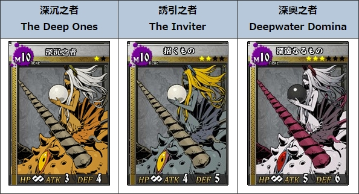
[^图7]: 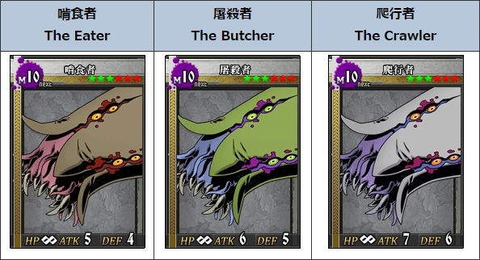
[^图8]: 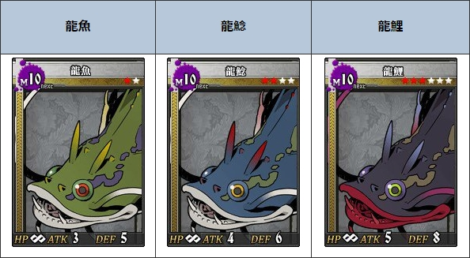
[^图9]: 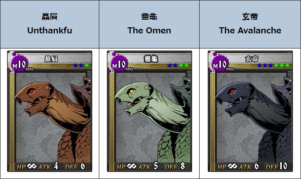
[^图10]: 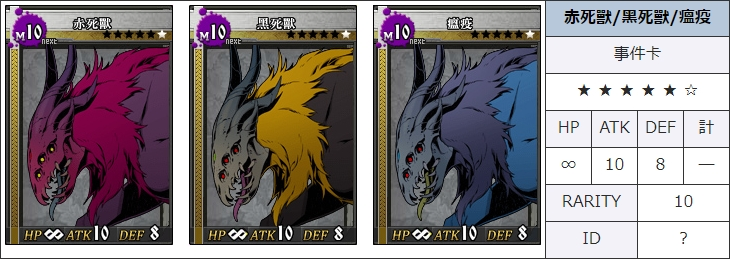
[^图11]: 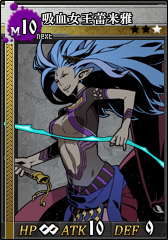
[^图12]: 

[^图标:atk↑]: 
[^图标:atk↓]: 
[^图标:def↑]: 
[^图标:def↓]: 
[^图标:mov↑]: 
[^图标:mov↓]: 
[^图标:狂战士]: 
[^图标:恐惧]: 
[^图标:傀儡]: 
[^图标:混沌]: 
[^图标:麻痹]: 
[^图标:诅咒]: 
[^图标:能力低下]: 
[^图标:毒]: 
[^图标:猛毒]: 
[^图标:临界]: 
[^图标:傀儡]: 
[^图标:再生]: 
[^图标:咒缚]: 
[^图标:圣痕]: 
[^图标:封印]: 
[^图标:自坏]: 
[^图标:操想]: 
[^图标:断绝]: 
[^图标:晕眩]: 
[^图标:标靶]: 
[^图标:棍术atk]: 
[^图标:棍术def]: 

